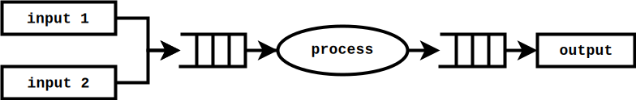

=========================================================
 |koika|: A Core Language for Rule-Based Hardware Design
=========================================================

This is the home of |koika|, an experimental hardware design language inspired by `BlueSpec SystemVerilog <http://wiki.bluespec.com/>`_.  |koika| programs are built from *rules*, small bits of hardware that operate concurrently to compute state updates but provide `the illusion of serializable (atomic) updates <atomic-actions_>`_.  |koika| has simple, precise semantics that give you `strong guarantees about the behavior of your designs <oraat_>`_.

Our distribution includes an `executable reference implementation of the language <formal-semantics_>`_ written using the `Coq proof assistant <https://coq.inria.fr/>`_, machine-checked proofs ensuring that |koika|'s semantics are compatible with `one-rule-at-a-time execution <oraat_>`_, and a `formally-verified compiler <compiler-verification_>`_ that generates circuits guaranteed to correctly implement your designs.

|koika| programs are typically written inside of Coq using an `embedded DSL <syntax_>`_ (this lets you leverage Coq's powerful metaprogramming features and modular abstractions), though we also have a more limited `standalone front-end <lispy-verilog_>`_ that accepts programs in serialized (s-expressions) form.  For simulation, debugging, and testing purposes, |koika| programs can be compiled into `readable, cycle-accurate C++ models <cuttlesim_>`_, and for synthesis the |koika| compiler targets a minimal subset of synthesizable Verilog supported by all major downstream tools.

|koika| is a research prototype: the circuits that our compiler generates typically have reasonable-to-good performance and area usage, but our RTL optimizer is very simple and can miss obvious improvements.  Because our simulator can take advantage of high-level information, |koika| designs typically run reasonably fast in C++ simulation.

Our largest example at the moment is a simple RISCV (RV32I) `4-stage pipelined core <examples/rv/RVCore.v>`_.

|koika| is currently developed as a joint research effort at MIT, involving members of CSG (the Computation Structure Group) and PLV (the Programming Languages & Verification group).  Our `latest draft <koika-paper_>`_ is a good place to get details about the research that powers it.  The name “|koika|” (甲イカ) is Japanese for “`cuttlefish <https://en.wikipedia.org/wiki/Cuttlefish>`_”; we chose it because cuttlefishes have blue blood (a tribute to the name Bluespec), and because their eight arms are equipped with independent neurons that allow them operate semi-independently towards a shared purpose, much like rules in |koika| designs.

This README provides practical information to get started with Kôika.  For details about Kôika's semantics, its compilation algorithm, and the work it draws inspiration from, please read our PLDI 2020 paper: `The Essence of Bluespec, A Core Language for Rule-Based Hardware Design <https://dl.acm.org/doi/10.1145/3385412.3385965>`_.

.. raw:: html

   

Getting started
===============

Installing dependencies and building from source
------------------------------------------------

* OCaml 4.07 through 4.09, `opam <https://opam.ocaml.org/doc/Install.html>`_ 2.0 or later, GNU make.

* Coq 8.9, 8.10, or 8.11::

    opam install coq=8.10.2

* Coq's Ltac2 plugin, if using Coq < 8.9 or 8.10 (newer versions have it built-in)::

    opam repo add coq-released https://coq.inria.fr/opam/released
    opam install coq-ltac2

* Dune 2.5 or later::

    opam upgrade dune

* Some OCaml packages::

    opam install base core stdio parsexp hashcons zarith

* To run the tests of our RISCV core, a `RISCV compilation toolchain <https://github.com/xpack-dev-tools/riscv-none-embed-gcc-xpack/releases/>`_.

* To run C++ simulations: a recent C++ compiler (clang or gcc) and
  ``libboost-dev``.

You can compile the full distribution, including examples, tests, and proofs by running ``make`` in the top-level directory of this repo.  Generated files are placed in ``_build``, ``examples/_objects/``,  ``tests/_objects/``, and  ``examples/rv/_objects/``.

Each directory in ``_objects`` contains `a Makefile <makefile_>`_ to ease further experimentation (including RTL simulation, profiling, trace generation, etc.).

.. opam show -f name,version coq dune base core stdio parsexp hashcons zarith | sed 's/name *//' | tr '\n' ' ' | sed 's/ *version */=/g' | xclip

For reproducibility, here is one set of versions known to work:

- OCaml 4.09 with ``opam install base=v0.13.1 coq=8.11.1 core=v0.13.0 dune=2.5.1 hashcons=1.3 parsexp=v0.13.0 stdio=v0.13.0 zarith=1.9.1``

Browsing examples
-----------------

The ``examples/`` directory of this repo demonstrates many of |koika|'s features.
The examples can be compiled using ``make examples``, and browsed in either
CoqIDE or Proof General.  There is basic Emacs support for ``.lv`` files (the “Lispy
Verilog” alternative frontend for |koika|) in ``etc/lv-mode.el``.

See `browsing the sources <repo-map_>`_ below for information about the repository's organization.

Compiling your own programs
---------------------------

Our compiler (``cuttlec``) supports multiple targets:

- ``verilog`` (an RTL implementation of your design expressed in the synthesizable subset of Verilog 2000)
- ``hpp`` (a cuttlesim model of your design, i.e. a cycle-accurate C++ implementation of it, useful for debugging)
- ``cpp`` (a driver for the cuttlesim model of your design)
- ``verilator`` (a simple C++ driver to simulate the Verilog using Verilator)
- ``makefile`` (an auto-generated Makefile including convenient targets to debug, profile, trace, or visualize the outputs of your design)
- ``dot`` (a basic representation of the RTL generated from your design)

For quick experimentation, you can just drop your files in ``examples/`` or ``tests/`` and run ``make examples/_objects/<your-file.v>/``.

Programs written in the Coq EDSL
~~~~~~~~~~~~~~~~~~~~~~~~~~~~~~~~

On the Coq side, after implementing your design, use the following to define a “package” (see the `<examples/>`_ directory for more information, or read the `<syntax_>`_ section below):

.. code:: coq

   Definition package :=
     Interop.Backends.register
       {| ip_koika := …;
          ip_sim := …;
          ip_verilog := … |}.
   Extraction "xyz.ml" package.

Compile your Coq sources using ``coqc`` or ``dune`` to generate ``xyz.ml``, then compile that file using ``cuttlec xyz.ml -T …``.

Among other things, a package contains instances of the ``Show`` typeclass used to print register names.  These instances are typically derived automatically, but customizing them makes it possible to control the names given to signals in the generated Verilog and C++ code (for example, instead of ``x0``, ``x1``, …, ``x31``, we use ``zero``, ``ra``, ``sp``, ``gp``, etc. in the RISCV core).

Programs written in serialized syntax (“Lispy Verilog”)
~~~~~~~~~~~~~~~~~~~~~~~~~~~~~~~~~~~~~~~~~~~~~~~~~~~~~~~

Use ``cuttlec your-program.lv -T verilog``, or any other output option as described by ``cuttlec --help``.

Technical overview
==================

.. _koika-paper:

Details about |koika|\ 's design and implementation can be found in our `research paper <https://pit-claudel.fr/clement/papers/koika-PLDI20.pdf>`_.

Execution model
---------------

.. _atomic-actions:

|koika| programs are made of *rules*, orchestrated by a *scheduler*.  Each rule is a program that runs once per cycle, as long as it does not conflict with other rules.  When conflicts arise (for example, when two rules attempt to write to the same register), the priority order specified by the scheduler determines which rule gets to fire (i.e. execute).  Concretely, a rule might look like this (this is a rule that takes one step towards computing the GCD of the numbers in registers ``gcd_a`` and ``gcd_b``):

.. code:: coq

   Definition gcd_compute := {{
     let a := read0(gcd_a) in
     let b := read0(gcd_b) in
     if a != |16`d0| then
       if a < b then
         write0(gcd_b, a);
         write0(gcd_a, b)
       else
         write0(gcd_a, a - b)
     else
       fail
   }}

.. _oraat:

The semantics of |koika| guarantee that each rule executes atomically, and that generated circuits behave one-rule-at-a-time — that is, even when multiple rules fire in the same cycle, the updates that they compute are as if only one rule had run per cycle (previous work used this property to define the language; in contrast, our semantics are more precise, and this atomicity property is proven in `<coq/OneRuleAtATime.v>`_).

As an example, consider a simple two-stage pipeline with two single-element input FIFOs and one single-element output FIFO:

We implement these FIFOs using three single-bit registers (``…_empty``) indicating whether each FIFO is empty, and three data registers (``…_data``) holding the contents of these FIFOs.  We have three rules: two to dequeue from the input FIFOs into a middle FIFO (``deq0`` and ``deq1``), and one to dequeue from the middle FIFO and write a result (the input plus 412) into an output FIFO (``process``).  The code looks like this (``guard(condition)`` is short for ``if !condition then fail``):

.. code:: coq

   (* This is a compact way to define deq0, deq1, and process: *)
   Definition rules (rl: rule_name_t) :=
     match rl with
     | deq0 =>
       {{ guard(!read0(in0_empty) && read0(fifo_empty));
          write0(fifo_data, read0(in0_data));
          write0(fifo_empty, Ob~0);
          write0(in0_empty, Ob~1) }}
     | deq1 =>
       {{ guard(!read0(in1_empty) && read0(fifo_empty));
          write0(fifo_data, read0(in1_data));
          write0(fifo_empty, Ob~0);
          write0(in1_empty, Ob~1) }}
     | process =>
       {{ guard(!read1(fifo_empty) && read0(out_empty));
          write0(out_data, read1(fifo_data) + |32`d412|);
          write1(fifo_empty, Ob~1);
          write0(out_empty, Ob~0) }}
     end.

A conflict arises when both inputs are available; what should happen in this case? The ambiguity is resolved by the scheduler:

.. code:: coq

   Definition pipeline : scheduler :=
     deq0 |> deq1 |> process |> done.

This sequence indicates that ``deq0`` has priority, so ``in_data0`` is processed first.  When both inputs are available and the middle FIFO is empty, when ``deq1`` attempts to run, it will dynamically fail when trying to write into ``fifo_data``.

This example includes a simple form of backpressure: if the middle FIFO is full, the first two rules will not run; if the output FIFO is full, the last rule will not run.  This is made explicit by the ``guard`` statements (those would be hidden inside the implementation of the ``dequeue`` and ``enqueue`` methods of the FIFO in a larger example, as demonstrated `below <modularity_>`_).

Looking carefully, you'll notice that ``read``\ s and ``write``\ s are annotated with ``0``\ s and ``1``\ s.  These are forwarding specifications, or “ports”.  Values written at port 0 are visible in the same cycle at port 1, and values written at port 1 overwrite values written at port 0.  Hence, this example defines a bypassing FIFO: values written by ``deq0`` and ``deq1`` are processed by ``process`` in the same cycle as they are written, assuming that there is space in the output FIFO.  If we had used a ``read0`` instead, we would have had a pipelined FIFO.

In this example, starting with the following values::

   in0_empty  ⇒ false
   in0_data   ⇒ 42
   in1_empty  ⇒ false
   in1_data   ⇒ 73
   fifo_empty ⇒ true
   fifo_data  ⇒ 0
   out_empty  ⇒ true
   out_data   ⇒ 0

we get the following output::

   in0_empty  ⇒ true
   in0_data   ⇒ 42
   in1_empty  ⇒ false
   in1_data   ⇒ 73
   fifo_empty ⇒ true
   fifo_data  ⇒ 42
   out_empty  ⇒ false
   out_data   ⇒ 454

.. _koika-syntax:

Syntax
------

|koika| programs are written using an embedded DSL inside of the Coq proof assistant.  After compiling the distribution, begin your file with ``Require Import Koika.Frontend``.

Preamble and types
~~~~~~~~~~~~~~~~~~

Start by defining the following types:

- ``reg_t``: An enumerated type describing the state of your machine.  For example,

  .. code:: coq

     Inductive reg_t :=
     (* These bypassing FIFOs are used to communicate with the memory *)
     | to_memory (state: MemReqFIFO.reg_t)
     | from_memory (state: MemRespFIFO.reg_t)
     (* These FIFOs are used to connect pipeline stages *)
     | d2e (state: fromDecodeFIFO.reg_t)
     | e2w (state: fromExecuteFIFO.reg_t)
     (* The register file and the scoreboard track and record reads and writes *)
     | register_file (state: Rf.reg_t)
     | scoreboard (state: Scoreboard.reg_t)
     (* These are plain registers, not module instances *)
     | pc
     | epoch.

- ``ext_fn_t``: An enumerated type describing custom combinational primitives (custom IP) that your program should have access to (custom sequential IP is implemented using external rules, which are currently a work in progress; see `<examples/rv/RVCore.v>`_ for a concrete example).  Use ``empty_ext_fn_t`` if you don't use external IP in your design.  For example,

  .. code:: coq

     Inductive ext_fn_t :=
     | custom_adder (size: nat).

Then, declare the types of the data held in each part of your state and the signatures of your external (combinational) IP (we usually name these functions ``R`` and ``Sigma``).  (In addition to bitsets, registers can contain structures, enums, or arrays of values; examples of these are given below.)

.. code:: coq

   Definition R (reg: reg_t) :=
     match reg with
     (* The type of the other modules is opaque; it's defined by the Rf module *)
     | to_memory st => MemReqFIFO.R st
     | register_file st => Rf.R st
     …
     (* Our own state is described explicitly: *)
     | pc => bits_t 32
     | epoch => bits_t 1
     end.

.. code:: coq

   Definition Sigma (fn: ext_fn_t): ExternalSignature :=
     match fn with
     | custom_adder sz => {$ bits_t sz ~> bits_t sz ~> bits_t sz $}
     end.

As needed, you can define your own custom types; here are a few examples:

.. code:: coq

   Definition proto :=
     {| enum_name := "protocol";
        enum_members :=
          vect_of_list ["ICMP"; "IGMP"; "TCP"; "UDP"];
        enum_bitpatterns :=
          vect_of_list [Ob~0~0~0~0~0~0~0~1; Ob~0~0~0~0~0~0~1~0;
                        Ob~0~0~0~0~0~1~1~0; Ob~0~0~0~1~0~0~0~1] |}.

.. code:: coq

   Definition flag :=
     {| enum_name := "flag";
        enum_members := vect_of_list ["set"; "unset"];
        enum_bitpatterns := vect_of_list [Ob~1; Ob~0] |}.

.. code:: coq

   Definition ipv4_address :=
     {| array_len := 4;
        array_type := bits_t 8 |}.

.. code:: coq

   Definition ipv4_header :=
     {| struct_name := "ipv4_header";
        struct_fields :=
          [("version", bits_t 4);
           ("ihl", bits_t 4);
           ("dscp", bits_t 6);
           ("ecn", bits_t 2);
           ("len", bits_t 16);
           ("id", bits_t 16);
           ("reserved", enum_t flag);
           ("df", enum_t flag);
           ("mf", enum_t flag);
           ("fragment_offset", bits_t 13);
           ("ttl", bits_t 8);
           ("protocol", enum_t proto);
           ("checksum", bits_t 16);
           ("src", array_t ipv4_address);
           ("dst", array_t ipv4_address)] |}.

.. code:: coq

   Definition result (a: type) :=
     {| struct_name := "result";
        struct_fields := [("valid", bits_t 1); ("value", a)] |}.

.. code:: coq

   Definition response := result (struct_t ipv4_header).

Rules
~~~~~

The main part of your program is rules.  You have access to the following syntax (there is no distinction between expressions and statements; statements are just expressions returning unit):

``pass``
  Do nothing
``fail``
  Abort the current rule, reverting all state changes
``let var := val in body``
  Let bindings
``set var := val``
  Assignments
``stmt1; stmt2``
  Sequence
``if val then val1 else val2``
  Conditional
``match val with  | pattern => body…  return default: body``
  Switches (case analysis)
``read0(reg)``, ``read1(reg)``, ``write0(reg)``, ``write1(reg)``
  Read or write a register at port 0 or 1
``pack(val)``, ``unpack(type, val)``
  Pack a value (go from struct, enum, or arrays to bits) or unpack a bitset
``get(struct, field)``, ``subst(struct, field, value)``
  Get a field of a struct value, or replace a field in a struct value (without mutating the original one)
``getbits(struct, field)``, ``substbits(struct, field, value)``
  Like get and subst, but on packed bitsets
``!x``, ``x && y``, ``x || y``, ``x ^ y``
  Logical operators (not, and, or, xor)
``x + y``, ``x - y``, ``x << y``, ``x >> y``, ``x >>> y``, ``zeroExtend(x, width)``, ``sext(x, width)``
  Arithmetic operators (plus, minus, logical shits, arithmetic shift right, left zero-extension, sign extension)
``x < y``, ``x <s y``, ``x > y``, ``x >s y``, ``x <= y``, ``x <s= y``, ``x >= y``, ``x >s= y``, ``x == y``, ``x != y``
  Comparison operators, signed and unsigned
``x ++ y``, ``x[y]``, ``x[y :+ z]``
  Bitset operators (concat, select, indexed part-select)
``instance.(method)(arg, …)``
  Call a method of a module
``function(args…)``
  Call an internal function
``extcall function(args…)``
  Call an external function (combinational IP)
``Ob~1~0~1~0``, ``|4`d10|``
  Bitset constants (here, the number 10 on 4 bits)
``struct name { field_n := val_n;… }``
  Struct constants
``enum name { member }``
  Enum constants
``#val``
  Lift a Coq value (for example a Coq definition)

For example, the following rule decreases the ``ttl`` field of an ICMP packet:

.. code:: coq

   Definition _decr_icmp_ttl := {{
     let hdr := unpack(struct_t ipv4_header, read0(input)) in
     let valid := Ob~1 in
     match get(hdr, protocol) with
     | enum proto { ICMP } =>
       let t := get(hdr, ttl) in
       if t == |8`d0| then set valid := Ob~0
       else set hdr := subst(hdr, ttl, t - |8`d1|)
     return default: fail
     end;
     write0(output, pack(struct response { valid := valid; value := hdr }))
   }}.

This rule fetches the next instruction in our RV32I core:

.. code:: coq

   Definition fetch := {{
     let pc := read1(pc) in
     write1(pc, pc + |32`d4|);
     toIMem.(MemReq.enq)(struct mem_req {
          byte_en := |4`d0|; (* Load *)
          addr := pc;
          data := |32`d0|
        });
     f2d.(fromFetch.enq)(struct fetch_bookkeeping {
          pc := pc;
          ppc := pc + |32`d4|;
          epoch := read1(epoch)
       })
   }}.

Rules are written in an untyped surface language; to typecheck a rule, use ``tc_action R Sigma rule_body``, or use ``tc_rules`` as shown below.

Schedulers
~~~~~~~~~~

A scheduler defines a priority order on rules: in each cycle rules appear to execute sequentially, and later rules that conflict with earlier ones do not execute (of course, all this is about semantics; the circuits generated by the compiler are (almost entirely) parallel).

A scheduler refers to rules by name, so you need three things:

- A rule name type:

  .. code:: coq

     Inductive rule_name_t :=
       start | step_compute | get_result.

- A scheduler definition:

  .. code:: coq

     Definition scheduler :=
       start |> step_compute |> get_result |> done.

- A mapping from rule names to (typechecked) rules:

  .. code:: coq

     Definition rules :=
       tc_rules R Sigma
         (fun rl =>
          match rl with
          | start => {{ … rule body … }}
          | step_compute => gcd_compute
          | get_result => {{ … rule body … }}
          end).

.. _formal-semantics:

Formal semantics
----------------

The semantics of |koika| programs are given by a reference interpreter written in Coq.  The results computed by this interpreter are the specification of the meaning of each program.

The reference interpreter takes three inputs:

- A program, using the syntax described above

- The initial value of each state element, ``r``

  .. code:: coq

     Definition r (reg: reg_t): R reg :=
       match reg with
       | to_memory st => MemReqFIFO.r st
       | register_file st => Rf.r st
       …
       | pc => Bits.zero
       | epoch => Bits.zero
       end.

- A Coq model of the external IP that you use, if any:

  .. code:: coq

     Definition sigma (fn: ext_fn_t): Sig_denote (Sigma fn) :=
       match fn with
       | custom_adder sz => fun (bs1 bs2: bits sz) => Bits.plus bs1 bs2
       end.

Then you can run your code:

.. code:: coq

   Definition cr := ContextEnv.(create) r.

   (* This computes a log of reads and writes *)
   Definition event_log :=
     tc_compute (interp_scheduler cr sigma rules scheduler).

   (* This computes the new value of each register *)
   Definition interp_result :=
     tc_compute (commit_update cr event_log).

This ``interp_scheduler`` function implements the executable reference semantics of |koika|; it can be used to prove properties about programs, to guarantee that program transformation are correct, or to verify a compiler.

.. _compiler-verification:

Compiler verification
---------------------

In addition to the reference interpreter, we have a verified compiler that targets RTL.  “Verified”, in this context, means that we have a machine-checked proof that the circuits produced by the compiler compute the exact same results as the original programs they were compiled from (the theorem is ``compiler_correct`` in `<coq/CircuitCorrectness.v>`_).

For instance, in the following example, our theorem guarantees that ``circuits_result`` matches ``interp_result`` above:

.. code:: coq

   Definition is_external (r: rule_name_t) :=
     false.

   Definition circuits :=
     compile_scheduler rules is_external collatz.

   Definition circuits_result :=
     tc_compute (interp_circuits (ContextEnv.(create) r) empty_sigma circuits).

.. _cuttlesim:

C++ Simulation
--------------

For simulation, debugging, and testing purposes, we have a separate compiler, ``cuttlesim``, which generates C++ models from |koika| designs.  The models are reasonably readable, suitable for debugging with GDB or LLDB, and typically run significantly faster than RTL simulation.  Here is a concrete example, generated from `<examples/gcd_machine.v>`_:

.. code:: c

   bool rule_step_compute() noexcept {
     {
       bits<16> a;
       READ0(step_compute, gcd_a, &a);
       {
         bits<16> b;
         READ0(step_compute, gcd_b, &b);
         if ((a != 16'0_b)) {
           if ((a < b)) {
             WRITE0(step_compute, gcd_b, a);
             WRITE0(step_compute, gcd_a, b);
           } else {
             WRITE0(step_compute, gcd_a, (a - b));
           }
         } else {
           FAIL_FAST(step_compute);
         }
       }
     }

     COMMIT(step_compute);
     return true;
   }

The Makefile generated by ``cuttlec`` contains multiple useful targets that can be used in connection with ``cuttlesim``; for example, coverage statistics (using ``gcov``) can be used to get a detailed picture of which rules of a design tend to fail, and for what reasons, which makes it easy to diagnose e.g. back-pressure due to incorrect pipelining setups.  Additionally, ``cuttlesim`` models can be used to generate value change dumps that can be visualized with `GTKWave <http://gtkwave.sourceforge.net/>`_.

Compilation
-----------

The usual compilation process for programs defined using our Coq EDSL in as follows:

1. Write you program as shown above.
2. Write a *package*, gathering all pieces of your program together; packages are documented in `<coq/Interop.v>`_.
3. Export that package using extraction to OCaml.
4. Compile this package to Verilog, C++, etc. using ``cuttlec``; this invokes the verified compiler to circuits and a thin unverified layer to produce RTL, or separate (unverified) code to produce C++ models and graphs.

Additional topics
=================

.. _makefile:

RTL Simulation, tracing, profiling, etc.
----------------------------------------

Running the ``cuttlec`` with the ``-t all`` flag generates all supported output formats, and a ``Makefile`` with a number of useful targets, including the following (replace ``collatz`` with the name of your design):

* ``make obj_dir/Vcollatz``

  Compile the generated RTL with Verilator.

* ``make gdb``

  Compile the C++ model of your design in debug mode, then run it under GDB.

* ``make collatz.hpp.gcov``

  Generate coverage statistics for the C++ model of your design (this shows which rules firer, how often then fire, and why they fail when they do).

* ``make NCYCLES=25 gtkwave.verilator``

  Compile the generated RTL with Verilator in ``--trace`` mode, then a VCD trace over 25 cycles and open it in GTKWave.

Use ``make help`` in the generated directory to learn more.

Function definitions
--------------------

It is often convenient to define reusable combinational functions separately, as in `this example <examples/rv/RVCore.v>`_:

.. code:: coq

   Definition alu32: UInternalFunction reg_t empty_ext_fn_t := {{
     fun (funct3: bits_t 3) (inst_30: bits_t 1)
         (a: bits_t 32) (b: bits_t 32): bits_t 32 =>
       let shamt := b[Ob~0~0~0~0~0 :+ 5] in
       match funct3 with
       | #funct3_ADD  => if (inst_30 == Ob~1) then a - b else a + b
       | #funct3_SLL  => a << shamt
       | #funct3_SLT  => zeroExtend(a <s b, 32)
       | #funct3_SLTU => zeroExtend(a < b, 32)
       | #funct3_XOR  => a ^ b
       | #funct3_SRL  => if (inst_30 == Ob~1) then a >>> shamt else a >> shamt
       | #funct3_OR   => a || b
       | #funct3_AND  => a && b
       return default: |32`d0|
       end
   }}.

That function would be called by writing ``alu32(fn3, i30, a, b)``.

.. _modularity:

Modularity
----------

Function definitions are best for stateless (combinational) programs.  For stateful code fragments, |koika| has a limited form of method calls.

The following (excerpted from `<examples/conflicts_modular.v>`_) defines a ``Queue32`` module implementing a bypassing FIFO, with methods to dequeue at port 0 and 1 and a method to enqueue at port 0.

.. code:: coq

   Module Import Queue32.
     Inductive reg_t := empty | data.

     Definition R reg :=
       match reg with
       | empty => bits_t 1
       | data => bits_t 32
       end.

     Definition dequeue0: UInternalFunction reg_t empty_ext_fn_t :=
       {{ fun dequeue0 () : bits_t 32 =>
            guard(!read0(empty));
            write0(empty, Ob~1);
            read0(data) }}.

     Definition enqueue0: UInternalFunction reg_t empty_ext_fn_t :=
       {{ fun enqueue0 (val: bits_t 32) : unit_t =>
            guard(read0(empty));
            write0(empty, Ob~0);
            write0(data, val) }}.

     Definition dequeue1: UInternalFunction reg_t empty_ext_fn_t :=
       {{ fun dequeue1 () : bits_t 32 =>
            guard(!read1(empty));
            write1(empty, Ob~1);
            read1(data) }}.
   End Queue32.

Our earlier example of conflicts can then be written thus:

.. code:: coq

   Inductive reg_t :=
   | in0: Queue32.reg_t -> reg_t
   | in1: Queue32.reg_t -> reg_t
   | fifo: Queue32.reg_t -> reg_t
   | out: Queue32.reg_t -> reg_t.

   Inductive rule_name_t := deq0 | deq1 | process.

   Definition R (reg: reg_t) : type :=
     match reg with
     | in0 st => Queue32.R st
     | in1 st => Queue32.R st
     | fifo st => Queue32.R st
     | out st => Queue32.R st
     end.

   Definition urules (rl: rule_name_t) :=
     match rl with
     | deq0 =>
       {{ fifo.(enqueue0)(in0.(dequeue0)()) }}
     | deq1 =>
       {{ fifo.(enqueue0)(in1.(dequeue0)()) }}
     | process =>
       {{ out.(enqueue0)(fifo.(dequeue1)() + |32`d412|) }}
     end.

.. _lispy-verilog:

Machine-friendly input
----------------------

When generating |koika| code from another language, it can be easier to target a format with a simpler syntax than our Coq EDSL.  In that case you can use Lispy Verilog, an alternative syntax for |koika| based on s-expressions.  See the `<examples/>`_ and `<tests/>`_ directories for more information; here is `one example <examples/collatz.lv>`_; the Coq version of the same program is in `<examples/collatz.v>`_:

.. code:: lisp

   ;;; Computing terms of the Collatz sequence (Lispy Verilog version)

   (defun times_three ((v (bits 16))) (bits 16)
     (+ (<< v 1'1) v))

   (module collatz
     (register r0 16'19)

     (rule divide
       (let ((v (read.0 r0))
             (odd (sel v 4'0)))
         (when (not odd)
           (write.0 r0 (lsr v 1'1)))))

     (rule multiply
       (let ((v (read.1 r0))
             (odd (sel v 4'0)))
         (when odd
           (write.1 r0 (+ (times_three v) 16'1)))))

     (scheduler main
       (sequence divide multiply)))

Browsing the sources
====================

The following list shows the current state of the repo:

.. _repo-map:

.. begin repo architecture

``coq/``
   ``CompilerCorrectness/``
      (Circuits)
         - |coq/CompilerCorrectness/CircuitCorrectness.v|_: Compiler correctness proof
         - |coq/CompilerCorrectness/LoweringCorrectness.v|_: Proof of correctness for the lowering phase

      - |coq/CompilerCorrectness/Correctness.v|_: End-to-end correctness theorem

   (Circuits)
      - |coq/CircuitGeneration.v|_: Compilation of lowered ASTs into RTL circuits
      - |coq/CircuitOptimization.v|_: Local optimization of circuits
      - |coq/CircuitProperties.v|_: Lemmas used in the compiler-correctness proof
      - |coq/CircuitSemantics.v|_: Interpretation of circuits
      - |coq/CircuitSyntax.v|_: Syntax of circuits (RTL)

   (Frontend)
      - |coq/Desugaring.v|_: Desugaring of untyped actions
      - |coq/ErrorReporting.v|_: Typechecking errors and error-reporting functions
      - |coq/Frontend.v|_: Top-level module imported by |koika| programs
      - |coq/IdentParsing.v|_: Ltac2-based identifier parsing for prettier notations
      - |coq/Parsing.v|_: Parser for the |koika| EDSL
      - |coq/Syntax.v|_: Untyped syntax
      - |coq/SyntaxFunctions.v|_: Functions on untyped ASTs, including error localization
      - |coq/SyntaxMacros.v|_: Macros used in untyped programs
      - |coq/TypeInference.v|_: Type inference and typechecking

   (Interop)
      - |coq/Compiler.v|_: Top-level compilation function and helpers
      - |coq/ExtractionSetup.v|_: Custom extraction settings (also used by external |koika| programs
      - |coq/Interop.v|_: Exporting |koika| programs for use with the cuttlec command-line tool

   (Language)
      - |coq/Logs.v|_: Logs of reads and writes
      - |coq/LoweredSemantics.v|_: Semantics of Lowered |koika| programs
      - |coq/LoweredSyntax.v|_: Lowered ASTs (weakly-typed)
      - |coq/Lowering.v|_: Compilation from typed ASTs to lowered ASTs
      - |coq/Primitives.v|_: Combinational primitives available in all |koika| programs
      - |coq/TypedSemantics.v|_: Semantics of typed |koika| programs
      - |coq/TypedSyntax.v|_: Typed ASTs
      - |coq/Types.v|_: Types used by |koika| programs

   (ORAAT)
      - |coq/OneRuleAtATime.v|_: Proof of the One-rule-at-a-time theorem
      - |coq/SemanticProperties.v|_: Properties of the semantics used in the one-rule-at-a-time theorem

   (Stdlib)
      - |coq/Std.v|_: Standard library

   (Tools)
      - |coq/LoweredSyntaxFunctions.v|_: Functions defined on lowered ASTs
      - |coq/Magic.v|_: Universal axiom to replace the ‘admit’ tactic
      - |coq/TypedSyntaxFunctions.v|_: Functions defined on typed ASTs
      - |coq/TypedSyntaxProperties.v|_: Lemmas pertaining to tools on typed syntax

   (Utilities)
      - |coq/Common.v|_: Shared utilities
      - |coq/DeriveShow.v|_: Automatic derivation of Show instances
      - |coq/Environments.v|_: Environments used to track variable bindings
      - |coq/EqDec.v|_: Decidable equality typeclass
      - |coq/FiniteType.v|_: Finiteness typeclass
      - |coq/IndexUtils.v|_: Functions on Vect.index elements
      - |coq/Member.v|_: Dependent type tracking membership into a list
      - |coq/Show.v|_: Show typeclass (α → string)
      - |coq/Vect.v|_: Vectors and bitvector library

   - |coq/BitTactics.v|_: Tactics for proofs about bit vectors
   - |coq/PrimitiveProperties.v|_: Equations showing how to implement functions on structures and arrays as bitfuns
   - |coq/ProgramTactics.v|_: Tactics for proving user-defined circuits

``examples/``
   ``fir.v.etc/``
      - |examples/fir.v.etc/extfuns.hpp|_: C++ implementation of external functions for the function_call example

   ``rv/``
      ``etc/``
         ``nangate45/``
            - |examples/rv/etc/nangate45/synth.sh|_: Yosys synthesis script for Nangate Open Cell Library (45nm)

         ``sv/``
            - |examples/rv/etc/sv/ext_mem.v|_: Wrapper used to connect the BRAM model with |koika|
            - |examples/rv/etc/sv/memory.v|_: Verilog model of a BRAM
            - |examples/rv/etc/sv/pll.v|_: PLL configuration for the TinyFPGA BX board
            - |examples/rv/etc/sv/top.v|_: Verilog wrapper for the |koika| core (for use in simulation)
            - |examples/rv/etc/sv/top_ice40_uart.v|_: Verilog wrapper for the |koika| core (for use in FPGA synthesis, with a UART interface)
            - |examples/rv/etc/sv/top_ice40_usb.v|_: Verilog wrapper for the |koika| core (for use in FPGA synthesis, with a USB interface)
            - |examples/rv/etc/sv/top_uart.v|_: Verilog wrapper for the |koika| core with a UART interface

         - |examples/rv/etc/elf.hpp|_: Support for loading ELF files
         - |examples/rv/etc/rvcore.cuttlesim.cpp|_: C++ driver for rv32i simulation with Cuttlesim
         - |examples/rv/etc/rvcore.pyverilator.py|_: Python driver for C++ simulation with Verilator
         - |examples/rv/etc/rvcore.verilator.cpp|_: C++ driver for rv32 simulation with Verilator

      - |examples/rv/Multiplier.v|_: Implementation of a multiplier module
      - |examples/rv/MultiplierCorrectness.v|_: Proof of correctness of the multiplier module
      - |examples/rv/RVCore.v|_: Implementation of our RISC-V core
      - |examples/rv/RVEncoding.v|_: Encoding-related constants
      - |examples/rv/Scoreboard.v|_: Implementation of a scoreboard
      - |examples/rv/rv32.v|_: Definition of a pipelined schedule
      - |examples/rv/rv32e.v|_: Pipelined instantiation of an RV32E core
      - |examples/rv/rv32i.v|_: Pipelined instantiation of an RV32I core

   - |examples/collatz.lv|_: Computing terms of the Collatz sequence (Lispy Verilog version)
   - |examples/collatz.v|_: Computing terms of the Collatz sequence (Coq version)
   - |examples/conflicts.v|_: Understanding conflicts and forwarding
   - |examples/conflicts_modular.v|_: Understanding conflicts and forwarding, with modules
   - |examples/datatypes.v|_: Using structures, enums, and arrays
   - |examples/external_rule.v|_: Calling external (verilog) modules from |koika|
   - |examples/fft.v|_: Computing a FIR (Coq version)
   - |examples/fir.v|_: Computing a FIR (Coq version)
   - |examples/function_call.v|_: Calling external functions
   - |examples/gcd_machine.v|_: Computing GCDs
   - |examples/method_call.v|_: Calling methods of internal modules
   - |examples/pipeline.v|_: Building simple pipelines
   - |examples/uart.v|_: UART transmitter
   - |examples/vector.v|_: Representing vectors of registers using Coq inductives

``ocaml/``
   ``backends/``
      ``resources/``
         - |ocaml/backends/resources/cuttlesim.cpp|_: Default driver for |koika| programs compiled to C++ using Cuttlesim
         - |ocaml/backends/resources/cuttlesim.hpp|_: Preamble shared by all |koika| programs compiled to C++
         - |ocaml/backends/resources/verilator.cpp|_: Default driver for |koika| programs compiled to C++ using Verilator
         - |ocaml/backends/resources/verilator.hpp|_: Preamble shared by all |koika| programs compiled to C++ using Verilator

      - |ocaml/backends/coq.ml|_: Coq backend (from Lispy Verilog sources)
      - |ocaml/backends/cpp.ml|_: C++ backend
      - |ocaml/backends/dot.ml|_: Graphviz backend
      - |ocaml/backends/gen.ml|_: Embed resources/* into resources.ml at build time
      - |ocaml/backends/makefile.ml|_: Makefile backend (to make it easier to generate traces, statistics, models, etc.)
      - |ocaml/backends/rtl.ml|_: Generic RTL backend
      - |ocaml/backends/verilator.ml|_: Verilator backend exporting a simple C++ driver
      - |ocaml/backends/verilog.ml|_: Verilog backend

   ``common/``
      - |ocaml/common/common.ml|_: Shared utilities

   ``cuttlebone/``
      (Interop)
         - |ocaml/cuttlebone/Extraction.v|_: Extraction to OCaml (compiler and utilities)

      - |ocaml/cuttlebone/cuttlebone.ml|_: OCaml wrappers around functionality provided by the library extracted from Coq

   ``frontends/``
      - |ocaml/frontends/coq.ml|_: Simple frontend to compile and load OCaml files extracted from Coq
      - |ocaml/frontends/lv.ml|_: Lispy Verilog frontend

   - |ocaml/cuttlec.ml|_: Command line interface to the compilers
   - |ocaml/interop.ml|_: Functions to use if compiling |koika| programs straight from Coq, without going through cuttlec
   - |ocaml/koika.ml|_: Top-level library definition
   - |ocaml/registry.ml|_: Stub used to load |koika| programs extracted from Coq into cuttlec

``tests/``
   - |tests/arrays.lv|_: Unit tests for array functions
   - |tests/bigint.lv|_: Computations with large bitvectors (the simulator uses boost for >64 bits)
   - |tests/comparisons.lv|_: Unit tests for comparison operators
   - |tests/datatypes.lv|_: Simple uses of structs and enums
   - |tests/double_write.v|_: Double-write detection and prevention
   - |tests/errors.1.lv|_: Syntax and typing errors in LV
   - |tests/errors.v|_: Syntax and typing errors in Coq
   - |tests/extcall.v|_: External functions
   - |tests/internal_functions.v|_: Intfun tests
   - |tests/large_trace.lv|_: Make sure that snapshots in large traces don't copy data
   - |tests/large_writeset.v|_: Make sure that the large writeset heuristics in the scheduler don't break things
   - |tests/mul.lv|_: Computations involving multiplication
   - |tests/muxelim.v|_: Sanity check for mux-elimination optimization
   - |tests/name_mangling.lv|_: Unit tests for name mangling
   - |tests/register_file_bypassing.v|_: Ensure that area is reasonable when bypasses don't need extra tracking
   - |tests/shadowing.lv|_: Unit tests for name shadowing
   - |tests/shifts.v|_: Regression test for signed shifts
   - |tests/signed.lv|_: Computations involving sign bits
   - |tests/struct_init.v|_: Structure initialization
   - |tests/switches.v|_: Test various forms of switches
   - |tests/taint_analysis.lv|_: Unit tests to ensure that impure functions are not optimized out
   - |tests/unpack.v|_: Structure unpacking

.. |coq/BitTactics.v| replace:: ``BitTactics.v``
.. _coq/BitTactics.v: coq/BitTactics.v
.. |coq/CircuitGeneration.v| replace:: ``CircuitGeneration.v``
.. _coq/CircuitGeneration.v: coq/CircuitGeneration.v
.. |coq/CircuitOptimization.v| replace:: ``CircuitOptimization.v``
.. _coq/CircuitOptimization.v: coq/CircuitOptimization.v
.. |coq/CircuitProperties.v| replace:: ``CircuitProperties.v``
.. _coq/CircuitProperties.v: coq/CircuitProperties.v
.. |coq/CircuitSemantics.v| replace:: ``CircuitSemantics.v``
.. _coq/CircuitSemantics.v: coq/CircuitSemantics.v
.. |coq/CircuitSyntax.v| replace:: ``CircuitSyntax.v``
.. _coq/CircuitSyntax.v: coq/CircuitSyntax.v
.. |coq/Common.v| replace:: ``Common.v``
.. _coq/Common.v: coq/Common.v
.. |coq/Compiler.v| replace:: ``Compiler.v``
.. _coq/Compiler.v: coq/Compiler.v
.. |coq/CompilerCorrectness/CircuitCorrectness.v| replace:: ``CircuitCorrectness.v``
.. _coq/CompilerCorrectness/CircuitCorrectness.v: coq/CompilerCorrectness/CircuitCorrectness.v
.. |coq/CompilerCorrectness/Correctness.v| replace:: ``Correctness.v``
.. _coq/CompilerCorrectness/Correctness.v: coq/CompilerCorrectness/Correctness.v
.. |coq/CompilerCorrectness/LoweringCorrectness.v| replace:: ``LoweringCorrectness.v``
.. _coq/CompilerCorrectness/LoweringCorrectness.v: coq/CompilerCorrectness/LoweringCorrectness.v
.. |coq/DeriveShow.v| replace:: ``DeriveShow.v``
.. _coq/DeriveShow.v: coq/DeriveShow.v
.. |coq/Desugaring.v| replace:: ``Desugaring.v``
.. _coq/Desugaring.v: coq/Desugaring.v
.. |coq/Environments.v| replace:: ``Environments.v``
.. _coq/Environments.v: coq/Environments.v
.. |coq/EqDec.v| replace:: ``EqDec.v``
.. _coq/EqDec.v: coq/EqDec.v
.. |coq/ErrorReporting.v| replace:: ``ErrorReporting.v``
.. _coq/ErrorReporting.v: coq/ErrorReporting.v
.. |coq/ExtractionSetup.v| replace:: ``ExtractionSetup.v``
.. _coq/ExtractionSetup.v: coq/ExtractionSetup.v
.. |coq/FiniteType.v| replace:: ``FiniteType.v``
.. _coq/FiniteType.v: coq/FiniteType.v
.. |coq/Frontend.v| replace:: ``Frontend.v``
.. _coq/Frontend.v: coq/Frontend.v
.. |coq/IdentParsing.v| replace:: ``IdentParsing.v``
.. _coq/IdentParsing.v: coq/IdentParsing.v
.. |coq/IndexUtils.v| replace:: ``IndexUtils.v``
.. _coq/IndexUtils.v: coq/IndexUtils.v
.. |coq/Interop.v| replace:: ``Interop.v``
.. _coq/Interop.v: coq/Interop.v
.. |coq/Logs.v| replace:: ``Logs.v``
.. _coq/Logs.v: coq/Logs.v
.. |coq/LoweredSemantics.v| replace:: ``LoweredSemantics.v``
.. _coq/LoweredSemantics.v: coq/LoweredSemantics.v
.. |coq/LoweredSyntax.v| replace:: ``LoweredSyntax.v``
.. _coq/LoweredSyntax.v: coq/LoweredSyntax.v
.. |coq/LoweredSyntaxFunctions.v| replace:: ``LoweredSyntaxFunctions.v``
.. _coq/LoweredSyntaxFunctions.v: coq/LoweredSyntaxFunctions.v
.. |coq/Lowering.v| replace:: ``Lowering.v``
.. _coq/Lowering.v: coq/Lowering.v
.. |coq/Magic.v| replace:: ``Magic.v``
.. _coq/Magic.v: coq/Magic.v
.. |coq/Member.v| replace:: ``Member.v``
.. _coq/Member.v: coq/Member.v
.. |coq/OneRuleAtATime.v| replace:: ``OneRuleAtATime.v``
.. _coq/OneRuleAtATime.v: coq/OneRuleAtATime.v
.. |coq/Parsing.v| replace:: ``Parsing.v``
.. _coq/Parsing.v: coq/Parsing.v
.. |coq/PrimitiveProperties.v| replace:: ``PrimitiveProperties.v``
.. _coq/PrimitiveProperties.v: coq/PrimitiveProperties.v
.. |coq/Primitives.v| replace:: ``Primitives.v``
.. _coq/Primitives.v: coq/Primitives.v
.. |coq/ProgramTactics.v| replace:: ``ProgramTactics.v``
.. _coq/ProgramTactics.v: coq/ProgramTactics.v
.. |coq/SemanticProperties.v| replace:: ``SemanticProperties.v``
.. _coq/SemanticProperties.v: coq/SemanticProperties.v
.. |coq/Show.v| replace:: ``Show.v``
.. _coq/Show.v: coq/Show.v
.. |coq/Std.v| replace:: ``Std.v``
.. _coq/Std.v: coq/Std.v
.. |coq/Syntax.v| replace:: ``Syntax.v``
.. _coq/Syntax.v: coq/Syntax.v
.. |coq/SyntaxFunctions.v| replace:: ``SyntaxFunctions.v``
.. _coq/SyntaxFunctions.v: coq/SyntaxFunctions.v
.. |coq/SyntaxMacros.v| replace:: ``SyntaxMacros.v``
.. _coq/SyntaxMacros.v: coq/SyntaxMacros.v
.. |coq/TypeInference.v| replace:: ``TypeInference.v``
.. _coq/TypeInference.v: coq/TypeInference.v
.. |coq/TypedSemantics.v| replace:: ``TypedSemantics.v``
.. _coq/TypedSemantics.v: coq/TypedSemantics.v
.. |coq/TypedSyntax.v| replace:: ``TypedSyntax.v``
.. _coq/TypedSyntax.v: coq/TypedSyntax.v
.. |coq/TypedSyntaxFunctions.v| replace:: ``TypedSyntaxFunctions.v``
.. _coq/TypedSyntaxFunctions.v: coq/TypedSyntaxFunctions.v
.. |coq/TypedSyntaxProperties.v| replace:: ``TypedSyntaxProperties.v``
.. _coq/TypedSyntaxProperties.v: coq/TypedSyntaxProperties.v
.. |coq/Types.v| replace:: ``Types.v``
.. _coq/Types.v: coq/Types.v
.. |coq/Vect.v| replace:: ``Vect.v``
.. _coq/Vect.v: coq/Vect.v
.. |examples/collatz.lv| replace:: ``collatz.lv``
.. _examples/collatz.lv: examples/collatz.lv
.. |examples/collatz.v| replace:: ``collatz.v``
.. _examples/collatz.v: examples/collatz.v
.. |examples/conflicts.v| replace:: ``conflicts.v``
.. _examples/conflicts.v: examples/conflicts.v
.. |examples/conflicts_modular.v| replace:: ``conflicts_modular.v``
.. _examples/conflicts_modular.v: examples/conflicts_modular.v
.. |examples/datatypes.v| replace:: ``datatypes.v``
.. _examples/datatypes.v: examples/datatypes.v
.. |examples/external_rule.v| replace:: ``external_rule.v``
.. _examples/external_rule.v: examples/external_rule.v
.. |examples/fft.v| replace:: ``fft.v``
.. _examples/fft.v: examples/fft.v
.. |examples/fir.v| replace:: ``fir.v``
.. _examples/fir.v: examples/fir.v
.. |examples/fir.v.etc/extfuns.hpp| replace:: ``extfuns.hpp``
.. _examples/fir.v.etc/extfuns.hpp: examples/fir.v.etc/extfuns.hpp
.. |examples/function_call.v| replace:: ``function_call.v``
.. _examples/function_call.v: examples/function_call.v
.. |examples/gcd_machine.v| replace:: ``gcd_machine.v``
.. _examples/gcd_machine.v: examples/gcd_machine.v
.. |examples/method_call.v| replace:: ``method_call.v``
.. _examples/method_call.v: examples/method_call.v
.. |examples/pipeline.v| replace:: ``pipeline.v``
.. _examples/pipeline.v: examples/pipeline.v
.. |examples/rv/Multiplier.v| replace:: ``Multiplier.v``
.. _examples/rv/Multiplier.v: examples/rv/Multiplier.v
.. |examples/rv/MultiplierCorrectness.v| replace:: ``MultiplierCorrectness.v``
.. _examples/rv/MultiplierCorrectness.v: examples/rv/MultiplierCorrectness.v
.. |examples/rv/RVCore.v| replace:: ``RVCore.v``
.. _examples/rv/RVCore.v: examples/rv/RVCore.v
.. |examples/rv/RVEncoding.v| replace:: ``RVEncoding.v``
.. _examples/rv/RVEncoding.v: examples/rv/RVEncoding.v
.. |examples/rv/Scoreboard.v| replace:: ``Scoreboard.v``
.. _examples/rv/Scoreboard.v: examples/rv/Scoreboard.v
.. |examples/rv/etc/elf.hpp| replace:: ``elf.hpp``
.. _examples/rv/etc/elf.hpp: examples/rv/etc/elf.hpp
.. |examples/rv/etc/nangate45/synth.sh| replace:: ``synth.sh``
.. _examples/rv/etc/nangate45/synth.sh: examples/rv/etc/nangate45/synth.sh
.. |examples/rv/etc/rvcore.cuttlesim.cpp| replace:: ``rvcore.cuttlesim.cpp``
.. _examples/rv/etc/rvcore.cuttlesim.cpp: examples/rv/etc/rvcore.cuttlesim.cpp
.. |examples/rv/etc/rvcore.pyverilator.py| replace:: ``rvcore.pyverilator.py``
.. _examples/rv/etc/rvcore.pyverilator.py: examples/rv/etc/rvcore.pyverilator.py
.. |examples/rv/etc/rvcore.verilator.cpp| replace:: ``rvcore.verilator.cpp``
.. _examples/rv/etc/rvcore.verilator.cpp: examples/rv/etc/rvcore.verilator.cpp
.. |examples/rv/etc/sv/ext_mem.v| replace:: ``ext_mem.v``
.. _examples/rv/etc/sv/ext_mem.v: examples/rv/etc/sv/ext_mem.v
.. |examples/rv/etc/sv/memory.v| replace:: ``memory.v``
.. _examples/rv/etc/sv/memory.v: examples/rv/etc/sv/memory.v
.. |examples/rv/etc/sv/pll.v| replace:: ``pll.v``
.. _examples/rv/etc/sv/pll.v: examples/rv/etc/sv/pll.v
.. |examples/rv/etc/sv/top.v| replace:: ``top.v``
.. _examples/rv/etc/sv/top.v: examples/rv/etc/sv/top.v
.. |examples/rv/etc/sv/top_ice40_uart.v| replace:: ``top_ice40_uart.v``
.. _examples/rv/etc/sv/top_ice40_uart.v: examples/rv/etc/sv/top_ice40_uart.v
.. |examples/rv/etc/sv/top_ice40_usb.v| replace:: ``top_ice40_usb.v``
.. _examples/rv/etc/sv/top_ice40_usb.v: examples/rv/etc/sv/top_ice40_usb.v
.. |examples/rv/etc/sv/top_uart.v| replace:: ``top_uart.v``
.. _examples/rv/etc/sv/top_uart.v: examples/rv/etc/sv/top_uart.v
.. |examples/rv/rv32.v| replace:: ``rv32.v``
.. _examples/rv/rv32.v: examples/rv/rv32.v
.. |examples/rv/rv32e.v| replace:: ``rv32e.v``
.. _examples/rv/rv32e.v: examples/rv/rv32e.v
.. |examples/rv/rv32i.v| replace:: ``rv32i.v``
.. _examples/rv/rv32i.v: examples/rv/rv32i.v
.. |examples/uart.v| replace:: ``uart.v``
.. _examples/uart.v: examples/uart.v
.. |examples/vector.v| replace:: ``vector.v``
.. _examples/vector.v: examples/vector.v
.. |ocaml/backends/coq.ml| replace:: ``coq.ml``
.. _ocaml/backends/coq.ml: ocaml/backends/coq.ml
.. |ocaml/backends/cpp.ml| replace:: ``cpp.ml``
.. _ocaml/backends/cpp.ml: ocaml/backends/cpp.ml
.. |ocaml/backends/dot.ml| replace:: ``dot.ml``
.. _ocaml/backends/dot.ml: ocaml/backends/dot.ml
.. |ocaml/backends/gen.ml| replace:: ``gen.ml``
.. _ocaml/backends/gen.ml: ocaml/backends/gen.ml
.. |ocaml/backends/makefile.ml| replace:: ``makefile.ml``
.. _ocaml/backends/makefile.ml: ocaml/backends/makefile.ml
.. |ocaml/backends/resources/cuttlesim.cpp| replace:: ``cuttlesim.cpp``
.. _ocaml/backends/resources/cuttlesim.cpp: ocaml/backends/resources/cuttlesim.cpp
.. |ocaml/backends/resources/cuttlesim.hpp| replace:: ``cuttlesim.hpp``
.. _ocaml/backends/resources/cuttlesim.hpp: ocaml/backends/resources/cuttlesim.hpp
.. |ocaml/backends/resources/verilator.cpp| replace:: ``verilator.cpp``
.. _ocaml/backends/resources/verilator.cpp: ocaml/backends/resources/verilator.cpp
.. |ocaml/backends/resources/verilator.hpp| replace:: ``verilator.hpp``
.. _ocaml/backends/resources/verilator.hpp: ocaml/backends/resources/verilator.hpp
.. |ocaml/backends/rtl.ml| replace:: ``rtl.ml``
.. _ocaml/backends/rtl.ml: ocaml/backends/rtl.ml
.. |ocaml/backends/verilator.ml| replace:: ``verilator.ml``
.. _ocaml/backends/verilator.ml: ocaml/backends/verilator.ml
.. |ocaml/backends/verilog.ml| replace:: ``verilog.ml``
.. _ocaml/backends/verilog.ml: ocaml/backends/verilog.ml
.. |ocaml/common/common.ml| replace:: ``common.ml``
.. _ocaml/common/common.ml: ocaml/common/common.ml
.. |ocaml/cuttlebone/Extraction.v| replace:: ``Extraction.v``
.. _ocaml/cuttlebone/Extraction.v: ocaml/cuttlebone/Extraction.v
.. |ocaml/cuttlebone/cuttlebone.ml| replace:: ``cuttlebone.ml``
.. _ocaml/cuttlebone/cuttlebone.ml: ocaml/cuttlebone/cuttlebone.ml
.. |ocaml/cuttlec.ml| replace:: ``cuttlec.ml``
.. _ocaml/cuttlec.ml: ocaml/cuttlec.ml
.. |ocaml/frontends/coq.ml| replace:: ``coq.ml``
.. _ocaml/frontends/coq.ml: ocaml/frontends/coq.ml
.. |ocaml/frontends/lv.ml| replace:: ``lv.ml``
.. _ocaml/frontends/lv.ml: ocaml/frontends/lv.ml
.. |ocaml/interop.ml| replace:: ``interop.ml``
.. _ocaml/interop.ml: ocaml/interop.ml
.. |ocaml/koika.ml| replace:: ``koika.ml``
.. _ocaml/koika.ml: ocaml/koika.ml
.. |ocaml/registry.ml| replace:: ``registry.ml``
.. _ocaml/registry.ml: ocaml/registry.ml
.. |tests/arrays.lv| replace:: ``arrays.lv``
.. _tests/arrays.lv: tests/arrays.lv
.. |tests/bigint.lv| replace:: ``bigint.lv``
.. _tests/bigint.lv: tests/bigint.lv
.. |tests/comparisons.lv| replace:: ``comparisons.lv``
.. _tests/comparisons.lv: tests/comparisons.lv
.. |tests/datatypes.lv| replace:: ``datatypes.lv``
.. _tests/datatypes.lv: tests/datatypes.lv
.. |tests/double_write.v| replace:: ``double_write.v``
.. _tests/double_write.v: tests/double_write.v
.. |tests/errors.1.lv| replace:: ``errors.1.lv``
.. _tests/errors.1.lv: tests/errors.1.lv
.. |tests/errors.v| replace:: ``errors.v``
.. _tests/errors.v: tests/errors.v
.. |tests/extcall.v| replace:: ``extcall.v``
.. _tests/extcall.v: tests/extcall.v
.. |tests/internal_functions.v| replace:: ``internal_functions.v``
.. _tests/internal_functions.v: tests/internal_functions.v
.. |tests/large_trace.lv| replace:: ``large_trace.lv``
.. _tests/large_trace.lv: tests/large_trace.lv
.. |tests/large_writeset.v| replace:: ``large_writeset.v``
.. _tests/large_writeset.v: tests/large_writeset.v
.. |tests/mul.lv| replace:: ``mul.lv``
.. _tests/mul.lv: tests/mul.lv
.. |tests/muxelim.v| replace:: ``muxelim.v``
.. _tests/muxelim.v: tests/muxelim.v
.. |tests/name_mangling.lv| replace:: ``name_mangling.lv``
.. _tests/name_mangling.lv: tests/name_mangling.lv
.. |tests/register_file_bypassing.v| replace:: ``register_file_bypassing.v``
.. _tests/register_file_bypassing.v: tests/register_file_bypassing.v
.. |tests/shadowing.lv| replace:: ``shadowing.lv``
.. _tests/shadowing.lv: tests/shadowing.lv
.. |tests/shifts.v| replace:: ``shifts.v``
.. _tests/shifts.v: tests/shifts.v
.. |tests/signed.lv| replace:: ``signed.lv``
.. _tests/signed.lv: tests/signed.lv
.. |tests/struct_init.v| replace:: ``struct_init.v``
.. _tests/struct_init.v: tests/struct_init.v
.. |tests/switches.v| replace:: ``switches.v``
.. _tests/switches.v: tests/switches.v
.. |tests/taint_analysis.lv| replace:: ``taint_analysis.lv``
.. _tests/taint_analysis.lv: tests/taint_analysis.lv
.. |tests/unpack.v| replace:: ``unpack.v``
.. _tests/unpack.v: tests/unpack.v
.. end repo architecture

.. |koika| replace:: Kôika
